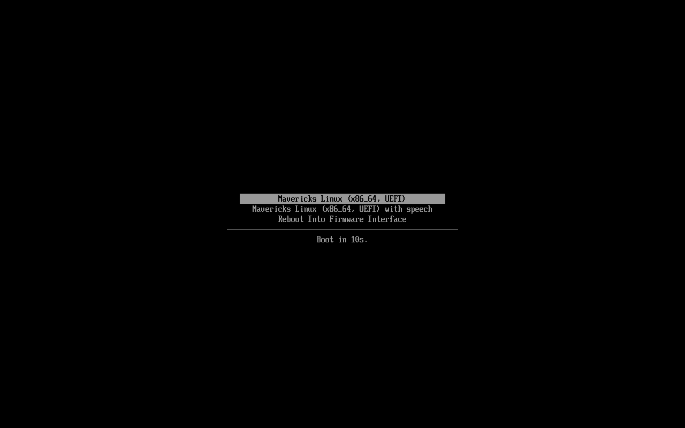

# MavLinOS

**MavLinOS is a Linux-based operating system whose user interface and user
experience are as close as technically possible to macOS Mavericks (10.9).**

Built on Arch Linux + Xfce, reusing mature Linux components wherever that is
reasonable. The goal is **not** a visual skin — it is the **Mavericks-era
interaction model**:

- window chrome and titlebar behavior
- the global menu bar and standard application menus
- the Dock (running-app indicators, magnification, trash)
- system applications: Finder, Spotlight, Launchpad, Mission Control,
  Control Center, Notification Center, Quick Look, System Preferences, and more
- dialogs, sheets, alerts and context menus
- animations and transitions
- keyboard shortcuts, including a global shortcut layer
- window management (spaces, minimize, zoom, fullscreen)
- notifications
- file management behavior (selection, drag-and-drop, Open With, Get Info,
  trash, eject)
- system interactions and application behavior
- the overall logic and *feel* of working in the system

**This is not:** a macOS clone, a GNOME/KDE theme, an icon pack, a visual
skin, an Electron app, or a "pretty Linux" distro. Linux internals stay
Linux — only the user-facing interaction layers follow Mavericks.

- **Repository:** https://github.com/AnsvipaRinh/MavLinOS
- **Public author:** Ansvipa_Rinh
- **License:** GPL-3.0-or-later (root `LICENSE`; per-package matrix in
  `docs/LICENSES.md`)

---

## Screenshots — the real build running (QEMU/OVMF, unretouched)

Framebuffer captures of the actual ISO (`out/`) booted in QEMU+OVMF.
Not mockups, not design comps — the shipped theme, Dock, panel and apps:

| | |
|---|---|
|  | **Boot** — systemd-boot (UEFI), MavLinOS entry |

Desktop, Finder, Spotlight and login captures are pending: each requires
a full desktop boot under TCG (tens of minutes per steady-state frame),
so they are added one at a time as verified captures land in
`docs/screenshots/`. No placeholders are linked.

Hardware screenshots on the real MacBook10,1 will be added when hardware
arrives (`docs/NEEDS_HARDWARE_TEST.md`).

---

## What am I looking at? (repository map)

This repo contains **an operating system** plus the **development
automation** that builds it. If you browse the file tree, separate the two:

**The OS itself — everything that lands in the ISO:**

- `archiso-profile/` — mkarchiso profile: ~750 packages, UEFI +
  systemd-boot, live/install environment. **This is where the Linux is.**
- `packages/` — the MavLinOS layer:
  - `mavericks-apps/` — the system applications: Finder helpers, Spotlight,
    Launchpad, Mission Control, Control Center, Notification Center,
    Settings, Activity Monitor, Disk Utility, and more. Python + GTK3 —
    the same approach GNOME system utilities use; the heavy lifting stays
    in mature backends (Thunar/GVfs, plocate, rofi, UDisks2, GStreamer).
  - `mavericks-theme/` — Mavericks GTK3/Xfce/Plank theme, icon theme,
    cursor theme (SCSS sources compiled to CSS, as GTK themes upstream do).
  - `macbook12-audio-driver/` — Cirrus CS42L83 DKMS driver (MacBook target).
- `configs/` — source of truth for the desktop: Xfce/LightDM/Thunar/Plank
  settings, Firefox ESR chrome, kernel-cmdline hardware profiles
  (`configs/profiles/`: `generic` core + `macbook10,1` profile).

**Development automation — NOT part of the OS, NOT in the ISO:**

- `scripts/`, `tools/` — build, validation gates, diagnostics, dev setup.
- `lab/` — A/B deploy + 25-scenario failure-injection test harness.
- `.opencode/`, `AGENTS.md`, `opencode.jsonc` — the autonomous-agent
  constitution and orchestration config this project is developed with
  (process infrastructure; safe to ignore if you only want the OS).

---

## Two goals

1. **Mavericks UI/UX fidelity** — the interaction model above, in the
   skeuomorphic 10.9 visual language (textures, gradients, glassy Dock),
   not modern flat macOS.
2. **Maximal practical optimization** — low resource usage, low power draw
   and fast interaction on weak hardware, including through specialized
   hardware profiles (see below).

---

## Architecture: generic core + hardware profiles

MavLinOS is explicitly split into two layers:

**Generic MavLinOS core** (machine-independent):

- common UI/UX and the Mavericks interaction model
- system applications
- themes (GTK/Xfce/Dock, icons, cursors)
- animations and transitions
- window management
- system integrations (D-Bus, systemd/logind, UDisks2, NetworkManager,
  BlueZ, PipeWire, …)
- general logic and performance architecture

**Hardware profiles** (machine-specific):

- CPU/GPU-specific tuning
- power management
- drivers and firmware integration
- input devices
- audio
- Wi-Fi/Bluetooth
- display
- storage
- thermal behavior
- boot/runtime configuration
- other machine-specific specifics

The current **MacBook10,1 (Mid 2017) profile is one specialized profile —
not the definition of the project.** Hardware-specific optimizations live in
profiles and must not pollute the generic core without necessity.

**Future:** a person with another computer (another MacBook or any other
compatible machine) can create a new hardware profile and get:
**MavLinOS core + their hardware profile → an optimized build for that
machine.** See `ARCHITECTURE.md` and `configs/profiles/`.

---

## Current implementation status (2026-10, pre-hardware)

| Layer | Status | Notes |
|-------|--------|-------|
| **Finder** | IMPLEMENTED — HARDWARE VALIDATION REQUIRED | Sidebar/bookmarks/navigation/views/context menus/Get Info/Open With/Rename/Trash/Eject/Quick Look/keyboard/MIME/dialogs + recursive search + column browser companion (see `docs/APPS.md` Finder row; commits `dfd8b04`, `a76050d`); visual validation on real 2304×1440 pending |
| **Core desktop (P0, rest)** | PARTIALLY IMPLEMENTED | Spotlight/Launchpad/Mission Control/Control Center/Notification Center/Quick Look/Dock/Menu Bar/Window Management/Global Dialogs/File Chooser/Context Menus/Keyboard Layer/Trash/Archive/Power UI — functional pre-hardware, hardware validation pending |
| **System apps (P1)** | PARTIALLY IMPLEMENTED | Activity Monitor, System Info, Disk Utility, Screenshot, TextEdit, Calculator, Notes, Reminders, Calendar, Music, Console, Keychain, Font Book, Color Meter, Stickies, Voice Memos — Mavericks UI over mature backends; HW validation pending |
| **P2 / Future** | DEFERRED / EXCLUDED | AirDrop, Time Machine UI, Automator/Shortcuts, Grapher, Migration Assistant, App Store, Software Update polish — explicitly not in scope for the current phase |
| **Excluded** | EXCLUDED | Contacts, TV, Podcasts, Siri, AirPlay, Chess, Game Center, dedicated Printer Discovery, Image Capture, Terminal replacement, mandatory account/password infra |

**Hardware-dependent items** (require real MacBook10,1): Wi-Fi (BCM43602),
audio (Cirrus CS42L83), applespi keyboard/trackpad, S3X NVMe resume,
display/brightness/thermal calibration, HiDPI pixel validation, power
measurements. See `docs/NEEDS_HARDWARE_TEST.md`. Native keyboard/trackpad
support (applespi) is best-effort; an external USB-C keyboard/mouse is the
recommended bring-up interface.

The screenshot above is a QEMU capture of the real build; on-hardware visual
validation happens when the machine arrives.

---

## Quick Start — Build ISO + Test

```bash
# 1. Build local packages (mavericks-apps, mavericks-theme, macbook12-audio-driver)
./scripts/build-local-pkgs.sh

# 2. Run pre-commit gate (144 checks: mirrors, syntax, security, ISO hardening)
./scripts/check-sync.sh --check-repos

# 3. Build ISO (requires root for mkarchiso; run on Arch host or CI)
sudo mkarchiso -v -w /tmp/archiso-build -o out/ archiso-profile/

# 4. Smoke test in QEMU+OVMF (UEFI, no KVM required)
qemu-system-x86_64 \
  -machine q35,accel=tcg \
  -cpu max -m 4G \
  -drive if=pflash,format=raw,readonly=on,file=/usr/share/edk2/x64/OVMF_CODE.4m.fd \
  -drive if=pflash,format=raw,file=/tmp/OVMF_VARS.fd \
  -cdrom out/mavericks-linux-*.iso \
  -netdev user,id=net0 -device e1000,netdev=net0 \
  -vga std -display gtk
```

**QEMU tests:** Sim backend (rootless, deterministic) — 25/25 scenarios pass.
QEMU backend — 7/25 pass (network boot); command-channel scenarios blocked on
9p virtfs. Mac backend — documented stub only. See `docs/LAB_HARNESS.md`.

---

## Repository Structure

Split by role — **OS content** (top) vs **development automation** (bottom):

```
.
# --- the operating system (lands in the ISO) ---
├── archiso-profile/          # mkarchiso profile (UEFI, systemd-boot, ~750 pkgs)
├── configs/                  # Source configs (mirrored to archiso-profile by check-sync)
│   ├── desktop/              # Xfce, LightDM, Plank, Thunar, skippy-xd, fonts
│   ├── firefox/              # Firefox ESR userChrome.css + user.js (Mavericks Safari 7)
│   ├── mv-ytplayer/          # Codec policy for mpv+yt-dlp video path
│   ├── network/              # NetworkManager pin + connectivity off
│   └── profiles/             # Kernel cmdline profiles (generic + macbook10,1)
├── packages/                 # Arch packages (repo-local, no AUR in default ISO)
│   ├── mavericks-apps/       # System applications (mv-*) + desktop files + rofi themes
│   ├── mavericks-theme/      # GTK3/Xfce/Plank theme + icon + cursor (SCSS → CSS)
│   ├── macbook12-audio-driver/  # Cirrus CS42L83 DKMS (tanisperez fork, pinned)
│   └── epiphany-mavericks-theme/  # DEFERRED (not in ISO)
# --- development automation (NOT in the ISO) ---
├── scripts/                  # Build, test, bench, install, diagnostics
├── tools/                    # Ad-hoc utilities (incl. wsl-environment-setup.sh)
├── lab/                      # Remote lab control plane (agent + harness + 25 scenarios)
├── docs/                     # All project documentation (see index below)
├── .opencode/                # Orchestrator + worker config (project-local)
├── AGENTS.md                 # Autonomous agent constitution (process infra)
└── opencode.jsonc            # Agent permission config
```

---

## Documentation Index

Reading order for people: **README (this file) → `CONTRIBUTING.md` →
`ARCHITECTURE.md`**. `AGENTS.md` is the agent constitution — process
infrastructure, not required human reading.

| File | Purpose |
|------|---------|
| `CONTRIBUTING.md` | How to contribute (read first as a human) |
| `ARCHITECTURE.md` | Layer diagram + profiles + lab harness |
| `AGENTS.md` | Autonomous agent constitution (process infra, not OS) |
| `docs/HARDWARE.md` | MacBook10,1 spec + base config |
| `docs/PROGRESS.md` | Phase-by-phase implementation log |
| `docs/APPS.md` | 46-objective application inventory + statuses |
| `docs/NEEDS_HARDWARE_TEST.md` | Every item requiring real hardware |
| `docs/SAFARI_SPEC.md` | Firefox chrome CSS fidelity spec (498 lines, 142-check gate) |
| `docs/PERF_CRITERIA.md` | Optimization stopping rules (P0/P1/P2/IGNORE) |
| `docs/BENCHMARKS.md` | Measured deltas + calibration maps |
| `docs/KEYBOARD.md` | Global Super-layer shortcut map |
| `docs/DECISIONS.md` | Every non-obvious decision + rationale |
| `docs/LAB_HARNESS.md` | A/B deploy + 25 failure-injection scenarios |
| `SECURITY.md` | Threat model + review verdicts + responsible disclosure |
| `docs/CONTRIBUTION_PROTOCOL.md` | End-to-end contribution flow (discovery → human merge) |
| `docs/SECURITY_MODEL.md` | Threat model, isolation guarantees, no-secrets-in-CI |
| `docs/VIBE_CODING.md` | External agent workflow |
| `docs/UI_UX_CONTRIBUTION.md` | Fidelity axes + completion criteria |
| `docs/GITHUB_SETUP.md` | First-time GitHub publish walkthrough |
| `docs/RELEASE_READINESS.md` | Pre-publication audit + publication procedure |
| `docs/LICENSES.md` | Full license matrix (all packages + backends) |

---

## Hardware profiles (OS-2c)

Two build profiles in `configs/profiles/` selected at ISO build time:

- **generic** — baseline Arch + Xfce + Mavericks theme, no MacBook drivers
- **macbook10,1** — + applespi, brcmfmac/broadcom-wl, Cirrus audio, S3X NVMe,
  `pcie_port_pm=off`, `i915.enable_psr=0`

Selector: `scripts/apply-hardware-selection.sh` (interactive, runs on first
boot). The generic profile is the clean core; the MacBook profile is the
reference hardware profile. New profiles follow the same separation rule:
**never add machine-specific configuration to the generic profile.**

---

## Contributing

Community participation is welcome across: **UI, UX, animations, window
management, applications, system integrations, performance, hardware profiles,
compatibility, documentation, testing, and tooling** — for example an animation
improvement, a window-behavior fix, a more precise Mavericks-like interaction,
an application improvement, or a hardware profile for a specific computer.

Public contributions are treated as **untrusted external input**: every
contribution passes the existing contribution/security/validation pipeline
(static security scan, classification, isolated build-agent testing, fidelity
and regression audit) before a human integration decision. **A community idea
can become part of the main MavLinOS codebase if it passes review and truly
fits the project goals — no contribution is accepted automatically.**

Start with `CONTRIBUTING.md` and `docs/CONTRIBUTION_PROTOCOL.md`.

---

## License

Project code: GPL-3.0-or-later (root `LICENSE`); per-package: GPL-2.0-or-later
(mavericks-apps), GPL-3.0-or-later (mavericks-theme). Full matrix:
`docs/LICENSES.md`. Upstream components retain their licenses (see
`docs/APPS.md` backend column). No Apple proprietary code/assets/resources.
Visual fidelity via reimplementation only.
